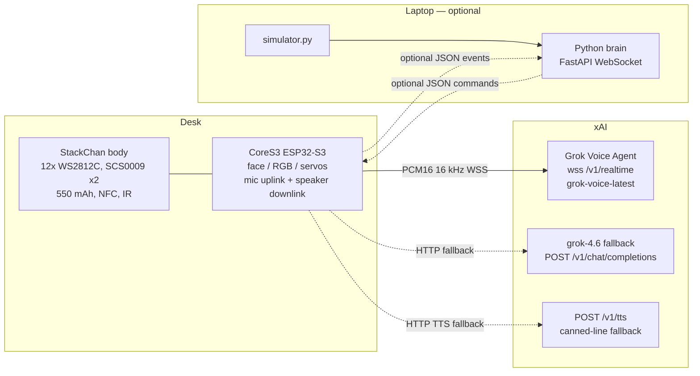

# Desk Rocky

M5Stack **StackChan** (CoreS3, kit SKU **K151-R**) as the body. The product is a **Grok Voice Agent**: Rocky **talks** out of the 1 W speaker. Caption-on-face is a fallback, not the product. No laptop required.

The CoreS3 opens `wss://api.x.ai/v1/realtime?model=grok-voice-latest`, streams the ES7210 mics up, and plays assistant PCM on the AW88298 speaker. If Voice WebSocket fails, it falls back to **grok-4.6** `POST /v1/chat/completions` (captions + tones) and, if that also fails, a canned **Friend! Friend! Friend!** + fist — still no laptop. A Python brain on a laptop remains an optional last path.

Personality is **Rocky** from *Project Hail Mary*. Owner: **Andrew Krowczyk**. License: MIT.

## Parts

| Piece | What |
|---|---|
| Body | [M5StackChan AI Desktop Robot Kit with Remote Control (ESP32-S3)](https://shop.m5stack.com/products/m5stackchan-ai-desktop-robot-kit-with-remote-control-esp32-s3) — SKU K151-R |
| Controller | CoreS3: ESP32-S3 @ 240 MHz, 16 MB flash, 8 MB PSRAM, 2.0" 320×240 IPS **ILI9342C** touch, **GC0308** camera, dual mics (**ES7210**), 1 W speaker (**AW88298**), **BMI270 + BMM150**, **LTR-553ALS-WA** proximity/ALS, microSD, Grove |
| Body extras | 12× **WS2812C**, IR, NFC **ST25R3916**, 550 mAh, two feedback servos (**SCS0009**): horizontal 360° continuous, vertical 90° |
| Network | 2.4 GHz Wi-Fi. Default path is xAI Voice (`grok-voice-latest`) over WSS. grok-4.6 chat/completions is the caption fallback. A laptop is optional. |

Docs used (do not invent pins): [StackChan](https://docs.m5stack.com/en/stackchan), [CoreS3](https://docs.m5stack.com/en/core/CoreS3), [StackChan Body](https://docs.m5stack.com/en/base/StackChan_Body), [Servo safety note](https://docs.m5stack.com/en/arduino/stackchan/servo), [m5stack/StackChan-BSP](https://github.com/m5stack/StackChan-BSP), [xAI Speech to Speech](https://docs.x.ai/developers/model-capabilities/audio/speech-to-speech), [Voice REST](https://docs.x.ai/developers/rest-api-reference/inference/voice).

## Architecture



Boot priority:

1. Wi-Fi from LittleFS `/wifi.json`
2. If `llm_base_url` + `llm_api_key` and `voice` is not `false`: **Voice mode**. Connect `wss://api.x.ai/v1/realtime?model=grok-voice-latest`, `session.update`, spoken boot greeting. Proximity: `motionSnapTowardPerson` then a documented text nudge (`conversation.item.create` + `response.create`) so Rocky greets without waiting for speech. **No laptop. Talking is the product.**
3. If Voice WSS fails: **grok-4.6** `llmAsk` (captions + tones). If that fails too: REST `POST /v1/tts` of the canned line on the speaker, else tones + caption.
4. Else if `brain_host` is set: existing WebSocket brain.
5. Else: existing 12-second offline demo.

If Wi-Fi fails entirely → offline demo, same as before.

## Servo safety

**Y-axis (pitch) command range is 5° to 85° only.** M5Stack: operating at extreme angles stalls the vertical servo and can permanently damage it. X-axis (yaw) has no angle restriction; this firmware still clamps look-commands to ±90° so a JSON typo cannot spin forever.

`motionLook()` is the only path that writes servo goal positions. It calls `clampPitch()` before any UART packet. There is no raw pitch API. Voice `body_act` pitch and LLM `look.pitch` both go through the same clamp.

Do not rotate the head by hand while motors are powered.

## Pin map and uncertainties

Confirmed from official PinMap + StackChan-BSP `servo_init`:

| Signal | Constant | Value | Confidence |
|---|---|---|---|
| Servo UART TX | `pins::SERVO_TX` | GPIO **6** | Official PinMap `Servo_TX`; BSP `_scs_bus.begin(UART_NUM_1, 1000000, 6, 7)` |
| Servo UART RX | `pins::SERVO_RX` | GPIO **7** | Official PinMap `Servo_RX` |
| Servo baud | `SERVO_UART_BAUD` | 1 000 000 | SCS0009 default + BSP |
| Yaw servo ID | `SERVO_ID_YAW` | **1** | stack-chan community + BSP |
| Pitch servo ID | `SERVO_ID_PITCH` | **2** | stack-chan community + BSP |
| IR send / rec | `IR_SEND` / `IR_REC` | GPIO **5** / **10** | Official PinMap (unused) |
| Body I2C | `I2C_SDA` / `I2C_SCL` | GPIO **12** / **11** | Official PinMap |
| PY32 expander | `PY32_ADDR_DEFAULT` | **0x6F** (alt **0x71**) | Official I2C table |
| RGB LEDs | `PY32_PIN_RGB` | expander pin **13** | **Not an ESP32 GPIO.** BSP + docs IO14=RGB |
| Servo power | `PY32_PIN_VM_EN` | expander pin **0** | BSP IO1=VM_EN |
| LTR-553 | `LTR553_ADDR` | **0x23** | CoreS3 docs |

**Uncertain (named constants, documented here, never magic numbers in motion code):**

1. **Yaw/pitch zero raw positions** (`SERVO_YAW_ZERO_RAW=460`, `SERVO_PITCH_ZERO_RAW=620`) are M5StackChan-BSP 1.0.1 *factory defaults*, not a measurement of *your* unit. Calibrate with the official “set current position as home” flow if the head is not square.
2. **Arduino `Serial1.begin(baud, cfg, RX, TX)` argument order** is the opposite of ESP-IDF `uart_set_pin(TX, RX)`. Firmware uses Arduino order: RX=7, TX=6. If the head does not move, this is the first thing to re-check.
3. **`range_mm` is a heuristic.** LTR-553 reports IR-reflectance counts. Lite-On and M5Stack do **not** document counts→mm. `proximityRangeMm()` exists only to fill the protocol field. Tune `PERSON_PS_THRESHOLD` on the actual desk.
4. PY32 I2C address is 0x6F unless `ADD_SEL` is high (0x71). Firmware probes both.
5. IR, NFC, camera: present on the kit, still unused.

### Voice / audio — verified vs uncertain

**Verified from docs (not hardware-tested in this tree):**

- xAI Voice WSS endpoint is `wss://api.x.ai/v1/realtime?model=grok-voice-latest` (alias of `grok-voice-think-fast-2.0`). Auth: `Authorization: Bearer <xAI API key>`.
- Client events used: `session.update`, `input_audio_buffer.append` (or binary frames), `conversation.item.create` (`message` / `function_call_output`), `response.create`.
- Server events handled: `session.created`, `session.updated`, `error`, `input_audio_buffer.speech_started`, `response.created`, `response.output_audio.delta` (and `response.audio.delta`), `response.output_audio.done`, `response.output_audio_transcript.delta`, `response.function_call_arguments.done`, `response.done`.
- Built-in voice id **`eve`** (docs default / example). Override with `llm_voice` in `wifi.json`. Do not invent a custom `voice_id`.
- PCM 16-bit little-endian is a documented codec; 16000 Hz is a documented rate (wideband). Binary transport is a documented `audio.*.transport` value. Arduino `WebSocketsClient` can `sendBIN` / receive `WStype_BIN`.
- CoreS3 **mic and speaker share I2S_NUM_1** (official M5Unified CoreS3 Mic sample: they cannot run at the same time). Firmware is **half-duplex**: listen XOR talk. No barge-in while Rocky is speaking.
- TLS: the WebSockets library calls `WiFiClientSecure::setInsecure()` when no CA/fingerprint is set. Same weekend-prototype TLS as the HTTPS chat client. **v1 is not cert-pinned.**

**Uncertain — first hardware bring-up must check these. Do not treat compile-success as a talk-test.**

- Exact `M5.Mic` / `M5.Speaker` sample rate that sounds clean on *this* CoreS3 StackChan (code uses 16 kHz because it is M5.Mic's default and a documented Voice rate). 24 kHz is the Voice API default; we picked 16 kHz for bandwidth + the Mic default.
- Whether Arduino `links2004/WebSockets` can complete TLS WSS to `api.x.ai` from CoreS3 (they already use it for the optional laptop brain on a *different* host, usually `ws://` not `wss://`). Handshake timeout is raised to 15 s (`WEBSOCKETS_TCP_TIMEOUT`). RAM during TLS + JSON + PCM is tight; PSRAM is used for audio buffers.
- Whether `grok-voice-latest` actually accepts 16 kHz PCM over **binary** frames after `session.update`. If the server ignores `transport: "binary"` and emits JSON `response.output_audio.delta`, the client also base64-decodes those.
- Mic gain (`M5.Mic` default `magnification=16`) and 1 W speaker volume (`SPEAKER_VOLUME=180` of 0..255). Desk distance, AGC, and clipping are unknown.
- I2S swap click/pop on `Mic.end` / `Speaker.begin` (known CoreS3 behavior). Firmware waits 80 ms between end and begin; pops may still be audible.
- Half-duplex means server VAD cannot hear the user while the speaker is up. Fine for a desk greeting; not a phone agent.

This tree has been **compile-checked only**. No CoreS3 was attached.

## Protocol

### Voice Agent (default)

Endpoint: `wss://api.x.ai/v1/realtime?model=<llm_voice_model>` with `Authorization: Bearer <llm_api_key>`.

On connect the body sends `session.update`:

- `instructions` — Rocky (short, telegraphic, leaky space blobs, Andrew is best friend, catchphrases, rule of threes). Tells the model it is **in** the StackChan body.
- `voice` — `eve` (or `llm_voice`)
- `reasoning.effort` — `none` (snappy desk lines; API default is `high`)
- `turn_detection.type` — `server_vad`
- `audio.input/output.format` — `audio/pcm` rate 16000, `transport` `binary`
- `tools` — one client function, `body_act` (`face`, `yaw`, `pitch`, `rgb`, `sound`, `fist`). Pitch still hits `motionLook()` clamp.

Boot and proximity **nudge** (documented, does not wait for speech):

```
{"type":"conversation.item.create","item":{"type":"message","role":"user",
  "content":[{"type":"input_text","text":"A leaky space blob just appeared close. ... Fist bump."}]}}
{"type":"response.create"}
```

`body_act` arrives as `response.function_call_arguments.done`. The body applies it, replies with `conversation.item.create` `function_call_output`, then `response.create` after speaker playback so audio does not overlap.

Transcript deltas are shown as the face caption **in addition to** speech. Caption-only is what you get if Voice is down.

### On-device grok-4.6 (Voice-down fallback)

The CoreS3 POSTs to `{llm_base_url}/chat/completions`. Same Rocky system prompt as before. Response `choices[0].message.content` is a JSON array of body commands (`say` is a caption, not TTS). Timeout ~20 s. This path **blocks** the main loop while HTTP is in flight — that is why Voice is the default.

### Optional laptop brain (WebSocket)

Used only if LLM fields are empty and `brain_host` is set:

```json
{"event":"boot"}
{"event":"person","range_mm":420}
```

### Body commands (chat fallback *and* WebSocket brain)

```json
{"say":"Friend! Friend! Friend!","face":"happy","sound":"chord_happy","look":{"yaw":0,"pitch":20},"rgb":"orange"}
{"say":"Fist my bump!","face":"fist"}
```

| Field | Values |
|---|---|
| `face` | `sleep` `happy` `think` `disgust` `amaze` `fist` |
| `sound` | `ping` `chord_happy` `whistle_thoughtful` |
| `look.yaw` | degrees, 0 = forward, + = left (official `moveX` sign) |
| `look.pitch` | degrees, 0 = down, 90 = up, **clamped 5..85**, home ≈ 45 |
| `rgb` | `orange` `blue` `sleep` `green` `red` `purple` `yellow` `off` or `#RRGGBB` |
| `say` | caption on the 320×240 face (fallback only — Voice plays audio) |

## wifi.json

Copy the example, fill secrets **on the device only**. `firmware/data/wifi.json` is gitignored. Never commit a real key.

| Field | Role |
|---|---|
| `ssid` / `password` | 2.4 GHz Wi-Fi |
| `llm_base_url` | OpenAI-compatible root for **chat fallback**, e.g. `https://api.x.ai/v1` |
| `llm_api_key` | xAI key from [console.x.ai](https://console.x.ai). Placeholder: `YOUR_XAI_API_KEY`. Used for Voice WSS, chat fallback, and TTS fallback. |
| `llm_model` | chat fallback model, default `grok-4.6` |
| `voice` | default `true`. Set `false` to skip Voice and use grok-4.6 captions only |
| `llm_voice_model` | Voice query param, default `grok-voice-latest` |
| `llm_voice` | Built-in voice id, default **`eve`** (docs example). Other documented ids include `ara`, `cosmo`, `rex` — see `GET /v1/tts/voices`. Do not invent one. |
| `brain_host` | optional laptop IP. Leave `""` for on-device Voice/LLM |
| `brain_port` / `brain_path` | WebSocket brain, default `8080` `/ws` |

Voice WSS always talks to `api.x.ai` (Speech-to-Speech is xAI-only). `llm_base_url` is for the chat/completions fallback, which can still be xAI or another OpenAI-compatible host.

## TLS (v1)

HTTPS chat uses `WiFiClientSecure` + `setInsecure()`. Voice WSS uses the same library path: empty fingerprint → `setInsecure()`. Fine for a desk toy; do not treat this as production TLS.

## Firmware (CoreS3)

PlatformIO + Arduino + M5Unified / M5GFX.

```bash
cd firmware
cp data/wifi.json.example data/wifi.json
# edit data/wifi.json — 2.4 GHz only
#   llm_api_key + voice=true  → robot TALKS (Grok Voice)
#   voice=false               → grok-4.6 captions + tones
#   brain_host="" unless you want the optional laptop brain
pio run -t uploadfs          # LittleFS: wifi.json -> /wifi.json
pio run -t upload
pio device monitor
```

`wifi.json` is gitignored. Commit only `wifi.json.example`.

Flash notes (from M5Stack): power via the **base** USB-C so a moving head cannot yank the cable. Hold **RST** ~3 s until the green LED lights, release — download mode.

If PlatformIO cannot see `m5stack-cores3` as a board name, this project uses the official docs env: `board = esp32-s3-devkitc-1` with 16 MB flash + USB CDC flags.

This tree was compiled on 2026-08-26 with PlatformIO (`espressif32@6.7.0`, Arduino, `esp32-s3-devkitc-1`) — **SUCCESS** (~1.21 MB flash / 1,272,549 bytes, 50 KB RAM / 51,480 bytes). **No hardware was attached.**

## Optional laptop brain

Still useful as a simulator or a local Ollama proxy. Not required.

```bash
cd brain
python3 -m venv .venv
source .venv/bin/activate   # Windows: .venv\Scripts\activate
pip install -r requirements.txt
python server.py            # 0.0.0.0:8080   ws://<laptop-ip>:8080/ws
```

To have the *laptop* call an LLM (instead of the robot), leave `llm_*` empty and set `brain_host`.

### Simulator

```bash
python brain/server.py
python brain/simulator.py --url ws://127.0.0.1:8080/ws --range-mm 420
```

## 12-second clip (offline demo)

If Wi-Fi is down, the body runs this loop (also the X/Twitter video path):

| t | What |
|---|---|
| 0.0–2.0 s | Sleep face, dim blue RGB, head home |
| 2.0–3.2 s | Proximity “person?”, think face, **ping** |
| 3.2–4.4 s | Head snap to pitch 20°, amaze |
| 4.4–5.6 s | **chord_happy**, orange RGB |
| 5.6–8.8 s | Happy eyes, caption **Friend! Friend! Friend!** |
| 8.8–12.0 s | Fist-bump graphic, **Fist my bump!** |

Online Voice path: fill `wifi.json` with an xAI key, boot Rocky, lean in. He should **speak**. If Voice is unreachable, grok-4.6 captions or the canned line still play.

## Rocky voice (baked in)

Short. Telegraphic. Mix me / I / Rocky. Humans = leaky space blobs. Self = scary space monster. Best friend = Andrew. Rule of threes. Catchphrases: **Amaze!** **Question!** **Fist my bump!** **It's full good!** **Disguuuuuust!**

Spoken with built-in voice **`eve`**. The character is in the `instructions`; the voice id is not a custom clone.
