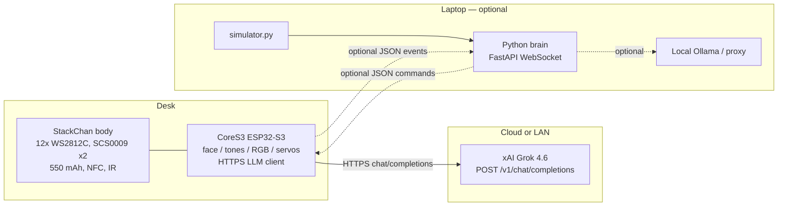

# Desk Rocky

M5Stack **StackChan** (CoreS3, kit SKU **K151-R**) as the body. The robot talks to **Grok 4.6** over HTTPS itself (`https://api.x.ai/v1`). No laptop required.

The Python brain on a laptop is an **optional** fallback (simulator, local Ollama proxy, or a WebSocket brain if you leave `llm_*` empty and set `brain_host`). Personality is **Rocky** from *Project Hail Mary*.

Owner: **Andrew Krowczyk**. License: MIT.

If Wi-Fi is down entirely, the body plays a scripted 12-second clip by itself. If the on-device LLM call fails, it still greets with a canned **Friend! Friend! Friend!** + fist bump — still no laptop.

## Parts

| Piece | What |
|---|---|
| Body | [M5StackChan AI Desktop Robot Kit with Remote Control (ESP32-S3)](https://shop.m5stack.com/products/m5stackchan-ai-desktop-robot-kit-with-remote-control-esp32-s3) — SKU K151-R |
| Controller | CoreS3: ESP32-S3 @ 240 MHz, 16 MB flash, 8 MB PSRAM, 2.0" 320×240 IPS **ILI9342C** touch, **GC0308** camera, dual mics (ES7210), 1 W speaker (AW88298), **BMI270 + BMM150**, **LTR-553ALS-WA** proximity/ALS, microSD, Grove |
| Body extras | 12× **WS2812C**, IR, NFC **ST25R3916**, 550 mAh, two feedback servos (**SCS0009**): horizontal 360° continuous, vertical 90° |
| Network | 2.4 GHz Wi-Fi. Path 2 talks HTTPS to xAI (`grok-4.6`) or any OpenAI-compatible `/v1/chat/completions` host. A laptop is optional. |

Docs used (do not invent pins): [StackChan](https://docs.m5stack.com/en/stackchan), [CoreS3](https://docs.m5stack.com/en/core/CoreS3), [StackChan Body](https://docs.m5stack.com/en/base/StackChan_Body), [Servo safety note](https://docs.m5stack.com/en/arduino/stackchan/servo), [m5stack/StackChan-BSP](https://github.com/m5stack/StackChan-BSP).

## Architecture



Boot priority:

1. Wi-Fi from LittleFS `/wifi.json`
2. If `llm_base_url` + `llm_api_key` are set: **LLM mode**. `llmAsk("boot")` on setup; proximity person (cooldown) does `motionSnapTowardPerson` then `llmAsk("person", mm)`. HTTP/parse failure → local canned greeting. **No laptop.**
3. Else if `brain_host` is set: existing WebSocket brain.
4. Else: existing 12-second offline demo.

If Wi-Fi fails entirely → offline demo, same as before.

## Servo safety

**Y-axis (pitch) command range is 5° to 85° only.** M5Stack: operating at extreme angles stalls the vertical servo and can permanently damage it. X-axis (yaw) has no angle restriction; this firmware still clamps look-commands to ±90° so a JSON typo cannot spin forever.

`motionLook()` is the only path that writes servo goal positions. It calls `clampPitch()` before any UART packet. There is no raw pitch API. LLM `look.pitch` values go through the same clamp.

Do not rotate the head by hand while motors are powered.

## Pin map and uncertainties

Confirmed from official PinMap + StackChan-BSP `servo_init`:

| Signal | Constant | Value | Confidence |
|---|---|---|---|
| Servo UART TX | `pins::SERVO_TX` | GPIO **6** | Official PinMap `Servo_TX`; BSP `_scs_bus.begin(UART_NUM_1, 1000000, 6, 7)` |
| Servo UART RX | `pins::SERVO_RX` | GPIO **7** | Official PinMap `Servo_RX` |
| Servo baud | `SERVO_UART_BAUD` | 1 000 000 | SCS0009 default + BSP |
| Yaw servo ID | `SERVO_ID_YAW` | **1** | stack-chan community + BSP |
| Pitch servo ID | `SERVO_ID_PITCH` | **2** | stack-chan community + BSP |
| IR send / rec | `IR_SEND` / `IR_REC` | GPIO **5** / **10** | Official PinMap (unused in v1) |
| Body I2C | `I2C_SDA` / `I2C_SCL` | GPIO **12** / **11** | Official PinMap |
| PY32 expander | `PY32_ADDR_DEFAULT` | **0x6F** (alt **0x71**) | Official I2C table |
| RGB LEDs | `PY32_PIN_RGB` | expander pin **13** | **Not an ESP32 GPIO.** BSP + docs IO14=RGB |
| Servo power | `PY32_PIN_VM_EN` | expander pin **0** | BSP IO1=VM_EN |
| LTR-553 | `LTR553_ADDR` | **0x23** | CoreS3 docs |

**Uncertain (named constants, documented here, never magic numbers in motion code):**

1. **Yaw/pitch zero raw positions** (`SERVO_YAW_ZERO_RAW=460`, `SERVO_PITCH_ZERO_RAW=620`) are M5StackChan-BSP 1.0.1 *factory defaults*, not a measurement of *your* unit. Calibrate with the official “set current position as home” flow if the head is not square.
2. **Arduino `Serial1.begin(baud, cfg, RX, TX)` argument order** is the opposite of ESP-IDF `uart_set_pin(TX, RX)`. Firmware uses Arduino order: RX=7, TX=6. If the head does not move, this is the first thing to re-check.
3. **`range_mm` is a heuristic.** LTR-553 reports IR-reflectance counts. Lite-On and M5Stack do **not** document counts→mm. `proximityRangeMm()` exists only to fill the protocol field. The LLM user message warns the model not to treat it as science. Tune `PERSON_PS_THRESHOLD` on the actual desk.
4. PY32 I2C address is 0x6F unless `ADD_SEL` is high (0x71). Firmware probes both.
5. IR, NFC, camera, mics: present on the kit, unused in v1.

## Protocol

### On-device LLM (Path 2 — default)

The CoreS3 POSTs to `{llm_base_url}/chat/completions` with `Authorization: Bearer {llm_api_key}`. Body is a small JSON object: `model`, `temperature`, `max_tokens`, `messages` (system = Rocky, user = boot or person). Timeout ~20 s. No streaming. Response `choices[0].message.content` must be a **JSON array** of body commands (markdown json fences are stripped).

User events:

```
Event: boot. Body just powered on. Greet. Short. You are in the desk robot.
Event: person. A leaky space blob is close. range_mm≈420 (this number is a lousy heuristic…). Be happy. Rule of threes. Fist bump.
```

While the request is in flight the face shows **think** + caption `think...`.

### Optional laptop brain (WebSocket)

Robot → brain (WebSocket text frames), used only if LLM fields are empty and `brain_host` is set:

```json
{"event":"boot"}
{"event":"person","range_mm":420}
```

### Body commands (LLM content *and* WebSocket)

```json
{"say":"Friend! Friend! Friend!","face":"happy","sound":"chord_happy","look":{"yaw":0,"pitch":20},"rgb":"orange"}
{"say":"Fist my bump!","face":"fist"}
```

Arrays of commands are accepted.

| Field | Values |
|---|---|
| `face` | `sleep` `happy` `think` `disgust` `amaze` `fist` |
| `sound` | `ping` `chord_happy` `whistle_thoughtful` |
| `look.yaw` | degrees, 0 = forward, + = left (official `moveX` sign) |
| `look.pitch` | degrees, 0 = down, 90 = up, **clamped 5..85**, home ≈ 45 |
| `rgb` | `orange` `blue` `sleep` `green` `red` `purple` `yellow` `off` or `#RRGGBB` |
| `say` | shown as a caption on the 320×240 face (no on-device TTS in v1) |

Rocky emotion tags in the system prompt map to `sound`: `[ping]` `[chord: happy]` `[whistle: thoughtful]`.

**Grok Voice is not v1.** Voice Agent is `wss://api.x.ai/v1/realtime?model=grok-voice-latest` — full-duplex audio, not JSON captions. Dual mics + 1 W speaker are on the kit; streaming PCM over that WebSocket is a later firmware job. v1 shows `say` on the face and plays tones.

## wifi.json

Copy the example, fill secrets **on the device only**. `firmware/data/wifi.json` is gitignored. Never commit a real key.

| Field | Role |
|---|---|
| `ssid` / `password` | 2.4 GHz Wi-Fi |
| `llm_base_url` | OpenAI-compatible root, xAI Chat Completions, e.g. `https://api.x.ai/v1` (no trailing `/chat/completions`) |
| `llm_api_key` | xAI key from [console.x.ai](https://console.x.ai). Placeholder: `YOUR_XAI_API_KEY` |
| `llm_model` | default `grok-4.6` |
| `brain_host` | optional laptop IP. Leave `""` for LLM-only |
| `brain_port` / `brain_path` | WebSocket brain, default `8080` `/ws` |

`llmConfigured()` is true only when **both** `llm_base_url` and `llm_api_key` are non-empty.

## TLS (v1)

Firmware uses `WiFiClientSecure` + `HTTPClient`. **v1 calls `setInsecure()`** — weekend-prototype TLS, because the hostname varies across compatible APIs (OpenAI, Groq, a LAN reverse-proxy, …). There is no baked-in CA pin. Fine for a desk toy; do not treat this as production TLS. Documented here so nobody mistakes it for cert pinning.

`http://` URLs (a local Ollama on the LAN) skip TLS and use a plain `WiFiClient`.

## Firmware (CoreS3)

PlatformIO + Arduino + M5Unified / M5GFX.

```bash
cd firmware
cp data/wifi.json.example data/wifi.json
# edit data/wifi.json — 2.4 GHz only
#   llm_base_url / llm_api_key / llm_model  → robot talks to the LLM itself
#   brain_host="" unless you want the optional laptop brain
pio run -t uploadfs          # LittleFS: wifi.json -> /wifi.json
pio run -t upload
pio device monitor
```

`wifi.json` is gitignored. Commit only `wifi.json.example`.

Flash notes (from M5Stack): power via the **base** USB-C so a moving head cannot yank the cable. Hold **RST** ~3 s until the green LED lights, release — download mode.

If PlatformIO cannot see `m5stack-cores3` as a board name, this project uses the official docs env: `board = esp32-s3-devkitc-1` with 16 MB flash + USB CDC flags.

This tree was compiled on 2026-08-26 with PlatformIO (`espressif32@6.7.0`, Arduino, `esp32-s3-devkitc-1`) — **SUCCESS** (~1.19 MB flash, 50 KB RAM). HTTPClient + WiFiClientSecure linked. No hardware was attached, so this is a compile-only check.

## Optional laptop brain

Still useful as a simulator or a local Ollama proxy. Not required for Path 2.

```bash
cd brain
python3 -m venv .venv
source .venv/bin/activate   # Windows: .venv\Scripts\activate
pip install -r requirements.txt
python server.py            # 0.0.0.0:8080   ws://<laptop-ip>:8080/ws
```

From repo root: `python brain/server.py`.

To have the *laptop* call an LLM (instead of the robot):

```bash
export OPENAI_COMPATIBLE_BASE_URL=https://api.x.ai/v1
export XAI_API_KEY=xai-...
export OPENAI_COMPATIBLE_MODEL=grok-4.6
python server.py
```

Then leave `llm_*` empty in `wifi.json` and set `brain_host` to the laptop's LAN IP.

### Simulator

Pretends to be the robot. Sends `boot`, then `person` with `range_mm=420`, prints every body command.

```bash
# terminal 1
python brain/server.py
# terminal 2
python brain/simulator.py
python brain/simulator.py --url ws://127.0.0.1:8080/ws --range-mm 420
```

You should see `Friend! Friend! Friend!` (happy, chord, look pitch 20) then `Fist my bump!` (fist face).

## 12-second clip (offline demo)

If Wi-Fi is down, the body runs this loop (also the X/Twitter video path):

| t | What |
|---|---|
| 0.0–2.0 s | Sleep face, dim blue RGB, head home |
| 2.0–3.2 s | Proximity “person?”, think face, **ping** |
| 3.2–4.4 s | Head snap to pitch 20°, amaze |
| 4.4–5.6 s | **chord_happy**, orange RGB |
| 5.6–8.8 s | Happy eyes, caption **Friend! Friend! Friend!** |
| 8.8–12.0 s | Fist-bump graphic, **Fist my bump!** |

How to film:

1. Desk, eye-level, landscape. Leave ~40 cm in front of the face so proximity can trigger on a real take (wave a hand). For a guaranteed take, just boot with Wi-Fi off — the scripted path does not need a hand.
2. Quiet room; the speaker is 1 W.
3. Start recording, power on (short-press the left POWER button). Wait for sleep eyes, then the snap.
4. Crop to the 12 seconds between first closed-eye frame and the fist-bump hold.

Online Path 2: fill `wifi.json` with LLM fields, boot Rocky, lean into the camera. Same beats, driven by `llmAsk("person")`. If the API is unreachable, the canned greeting still plays.

## Rocky voice (baked in)

Short. Telegraphic. Mix me / I / Rocky. Humans = leaky space blobs. Self = scary space monster. Best friend = Andrew. Rule of threes. Catchphrases: **Amaze!** **Question!** **Fist my bump!** **It's full good!** **Disguuuuuust!**
